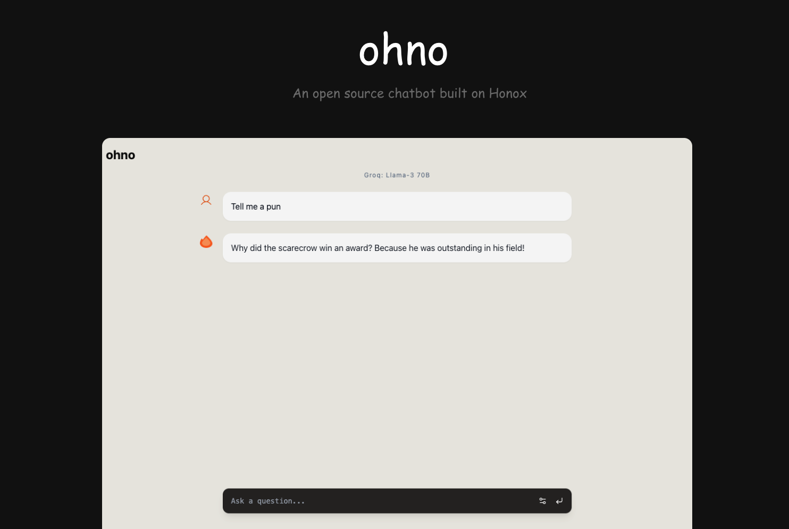

# ohno

  

<strong>ohno</strong> is a lightning-fast AI chatbot built with the Hono.js framework, React, and Tailwind CSS.

## Models and Providers

ohno supports the following AI models and providers:

- Groq: Llama-3 70B
- Snowflake Cortex: Mixtral 8x7B
- Cloudflare Workers AI: Llama-3 8B

You can easily switch between models and providers to experiment with different AI models.

## Developing

- Clone the repository
- Install the dependencies: `npm install`
- Configure the credentials in the `wrangler.toml` file
- Deploy api route for snowflake model in a nodejs runtime or run it locally and attach it to a cloudflare tunnel
- Start the development server: `npm run dev`

## Credits

- @yusukebe creator of the [Hono.js]("https://hono.dev/") framework
- @yossydev for the Shadcn Template

## License

ohno is open-source software licensed under the [MIT License](LICENSE).
